# Keyword Cluster Map — serpstrategists.com
*Generated: 2026-07-05 | Source: Live SerpAPI | US / EN | 24 Keywords × 6 Clusters*

---

## 🎯 Master Priority Table

> All 24 keywords ranked by opportunity. Start from the top.

| Priority | Keyword | Cluster | Difficulty | AI Overview | Action |
|:---:|---|---|:---:|:---:|---|
| 1 | `autonomous growth operations` | Brand Category | 🟡 MEDIUM | ✓ | Write pillar — no product page exists |
| 2 | `autonomous seo agent` | AI SEO Agent | 🟢 **LOW** | ✓ | Publish product page + how-it-works guide |
| 3 | `ai growth ops` | Brand Category | 🟢 **LOW** | ✗ | Capture definition content |
| 4 | `ai seo agent vs agency` | AI SEO Agent | 🟡 MEDIUM | ✓ | Strengthen existing blog post |
| 5 | `geo optimization` | GEO | 🟡 MEDIUM | ✓ | Expand pillar guide |
| 6 | `what is geo optimization` | GEO | 🟡 MEDIUM | ✓ | Add FAQ schema, answer blocks |
| 7 | `geo vs seo` | GEO | 🟡 MEDIUM | ✓ | Add comparison table |
| 8 | `answer engine optimization` | AEO | 🟡 MEDIUM | ✓ | Publish comprehensive guide |
| 9 | `how to appear in google ai overviews` | AEO | 🟡 MEDIUM | ✓ | Checklist-format how-to guide |
| 10 | `AEO digital marketing` | AEO | 🟡 MEDIUM | ✓ | Definition + positioning piece |
| 11 | `ai growth operator` | Brand Category | 🟡 MEDIUM | ✓ | Write authoritative brand definition |
| 12 | `seo automation software` | AI SEO Agent | 🟡 MEDIUM | ✓ | Comparison / category page |
| 13 | `llm seo optimization` | LLM Visibility | 🟡 MEDIUM | ✓ | Technical guide |
| 14 | `optimize for ai search engines` | LLM Visibility | 🟡 MEDIUM | ✓ | Practical how-to guide |
| 15 | `how to appear in perplexity` | LLM Visibility | 🟡 MEDIUM | ✓ | Optimize existing post |
| 16 | `best ai seo tools 2026` | Commercial | 🟡 MEDIUM | ✓ | Get listed in roundups |
| 17 | `ai seo tools pricing comparison` | Commercial | 🟡 MEDIUM | ✓ | Comparison page |
| 18 | `brand serp optimization` | Commercial | 🟡 MEDIUM | ✓ | Product use-case page |
| 19 | `ai seo agent` | AI SEO Agent | 🔴 HIGH | ✓ | Strengthen homepage + product page |
| 20 | `agentic seo` | AI SEO Agent | 🔴 HIGH | ✓ | Thought-leadership piece |
| 21 | `generative engine optimization` | GEO | 🔴 HIGH | ✓ | Pillar page — deep authority |
| 22 | `geo seo guide` | GEO | 🔴 HIGH | ✓ | Merge with GEO pillar |
| 23 | `aeo vs seo` | AEO | 🔴 HIGH | ✓ | Comparison piece |
| 24 | `get cited in chatgpt search` | LLM Visibility | 🔴 HIGH | ✓ | Step-by-step guide |

---

## Cluster Map Diagram

```mermaid
graph TD
    HOME["🏠 Homepage<br/>ai seo agent"]

    subgraph C1["🏷️ Cluster 1: Brand Category"]
        C1A["What is an AI Growth Operator?<br/><small>ai growth operator · MEDIUM</small>"]
        C1B["AI Growth Ops Guide<br/><small>ai growth ops · LOW ⭐</small>"]
        C1C["Autonomous Growth OS<br/><small>autonomous growth operations · MEDIUM</small>"]
    end

    subgraph C2["🤖 Cluster 2: AI SEO Agent"]
        C2A["Product Page — AI SEO Agent<br/><small>ai seo agent · HIGH</small>"]
        C2B["Autonomous SEO Agent Guide<br/><small>autonomous seo agent · LOW ⭐</small>"]
        C2C["Agentic SEO Explained<br/><small>agentic seo · HIGH</small>"]
        C2D["AI SEO Agent vs Agency<br/><small>ai seo agent vs agency · MEDIUM</small>"]
        C2E["SEO Automation Software<br/><small>seo automation software · MEDIUM</small>"]
    end

    subgraph C3["🌐 Cluster 3: GEO"]
        C3A["GEO Pillar Guide<br/><small>generative engine optimization · HIGH</small>"]
        C3B["GEO Optimization Explained<br/><small>geo optimization · MEDIUM</small>"]
        C3C["What is GEO?<br/><small>what is geo optimization · MEDIUM</small>"]
        C3D["GEO vs SEO<br/><small>geo vs seo · MEDIUM</small>"]
        C3E["GEO SEO Guide<br/><small>geo seo guide · HIGH → merge with C3A</small>"]
    end

    subgraph C4["💬 Cluster 4: AEO"]
        C4A["AEO Complete Guide<br/><small>answer engine optimization · MEDIUM</small>"]
        C4B["AEO vs SEO<br/><small>aeo vs seo · HIGH</small>"]
        C4C["How to Appear in AI Overviews<br/><small>how to appear in google ai overviews · MEDIUM</small>"]
        C4D["AEO in Digital Marketing<br/><small>AEO digital marketing · MEDIUM</small>"]
    end

    subgraph C5["🔮 Cluster 5: LLM Visibility"]
        C5A["How to Appear in Perplexity<br/><small>how to appear in perplexity · MEDIUM</small>"]
        C5B["Get Cited in ChatGPT<br/><small>get cited in chatgpt search · HIGH</small>"]
        C5C["LLM SEO Optimization<br/><small>llm seo optimization · MEDIUM</small>"]
        C5D["Optimize for AI Search<br/><small>optimize for ai search engines · MEDIUM</small>"]
    end

    subgraph C6["🛒 Cluster 6: Commercial"]
        C6A["Best AI SEO Tools 2026<br/><small>best ai seo tools 2026 · MEDIUM</small>"]
        C6B["AI SEO Pricing Comparison<br/><small>ai seo tools pricing comparison · MEDIUM</small>"]
        C6C["Brand SERP Optimization<br/><small>brand serp optimization · MEDIUM</small>"]
    end

    HOME --> C1A & C2A & C3A & C4A & C5A & C6A
    C1A --> C1B & C1C
    C2A --> C2B & C2C & C2D & C2E
    C3A --> C3B & C3C & C3D
    C4A --> C4B & C4C & C4D
    C5A --> C5B & C5C & C5D
    C6A --> C6B & C6C
```



---

## Cluster 1: Brand Category — AI Growth Operator

> **Strategic goal:** Define and own the "AI Growth Operator" category. No established player has claimed this term.

| Keyword | Difficulty | AI OV | Results | Who's Ranking |
|---|:---:|:---:|:---:|---|
| `ai growth operator` | 🟡 MEDIUM | ✓ | 7 | reddit.com, aigrowthops.com, summitpartners.com |
| `ai growth ops` | 🟢 **LOW** | ✗ | 6 | aigrowthops.com, linkedin.com, adasight.com |
| `autonomous growth operations` | 🟡 MEDIUM | ✓ | 9 | boardofinnovation.com, forrester.com, sap.com |

### "ai growth operator" — Content Briefs

**People Also Ask (write answers to all of these):**
- How much do growth operators make?
- What does a growth operator do?
- What is an AI growth agency?
- What is an AI operator?

**Related Searches → long-tail articles:**
`ai growth operator salary` · `ai growth operator jobs` · `ai growth operator course` · `reddit growth operating`

**📝 Page to create:** *"What is an AI Growth Operator? The Operating Layer Above Traditional SEO"*
- Format: Definition → Problem it solves → How it works → Who needs it → CTA
- Key answer block (40-60 words for AI Overview extraction):
  > *"An AI Growth Operator is an autonomous system that replaces manual SEO and growth agency functions by continuously auditing, fixing, publishing, and monitoring organic visibility across Google and AI search engines — without requiring human execution for each task."*

---

### "ai growth ops" — Content Briefs

**Related Searches → content angles:**
`ai growth ops reviews` · `ai in revenue operations` · `ai tools for revops`

**📝 Page to create:** *"AI Growth Ops vs AI Growth Operator: What's the Difference?"* — capture this LOW-difficulty term fast since no AI Overview is active yet.

---

## Cluster 2: Core Product — AI SEO Agent

> **Strategic goal:** Rank for product discovery and bottom-funnel comparison terms. "autonomous seo agent" is a quick win.

| Keyword | Difficulty | AI OV | Results | Who's Ranking |
|---|:---:|:---:|:---:|---|
| `ai seo agent` | 🔴 HIGH | ✓ | 8 | reddit.com, nightwatch.io, **ahrefs.com**, frase.io |
| `autonomous seo agent` | 🟢 **LOW** | ✓ | 6 | indexableai.com, fastcompany.com, nightwatch.io |
| `agentic seo` | 🔴 HIGH | ✓ | 8 | reddit.com, wordlift.io, seo.com, searchengineland.com |
| `ai seo agent vs agency` | 🟡 MEDIUM | ✓ | 7 | getaira.io, reddit.com, youtube.com |
| `seo automation software` | 🟡 MEDIUM | ✓ | 9 | siteimprove.com, marketermilk.com, nytroseo.com |

### "autonomous seo agent" — TOP PRIORITY (LOW difficulty)

**Top 3 ranking pages today:**
1. [AI SEO Agents: The Complete Guide to Autonomous...](https://indexableai.com/agentic-seo/seo-agents-complete-guide/) — indexableai.com
2. [Autonomous SEO agents are the next frontier of search](https://www.fastcompany.com/91563940/autonomous-seo-agents-are-the-next-frontier-of-search) — fastcompany.com
3. [The 8 Best AI SEO Agents in 2026](https://nightwatch.io/blog/best-ai-seo-agents/) — nightwatch.io

**Gap:** None of these is a product that actually does the work. SerpStrategists can rank here with a how-it-works + live demo product page.

**📝 Page to create:** *"How Autonomous SEO Agents Work — And Why SerpStrategists Is One"*

---

### "ai seo agent vs agency" — MEDIUM difficulty, high conversion

**Top 3 ranking pages today:**
1. [AI SEO Agent vs SEO Agency: Full 2026 Comparison](https://www.getaira.io/blog/ai-seo-vs-seo-agency) — getaira.io (#1)
2. Reddit discussion
3. YouTube tutorial

**Gap:** getaira.io is ranking #1 with a blog post. SerpStrategists already has a blog post on this topic — it needs a comparison table, pricing data, and FAQ schema to beat getaira.io.

**📝 Refresh action:** Add side-by-side comparison table (cost/speed/GEO coverage/control dimensions) + FAQ schema.

---

### "seo automation software" — People Also Ask

- Can you automate SEO?
- Is SEO dead or evolving in 2026?
- Which software is best for SEO?
- What is the 80/20 rule of SEO?

**Related Searches:** `seo automation software free` · `best seo automation software` · `seo automation AI`

---

## Cluster 3: GEO — Generative Engine Optimization

> **Strategic goal:** Own the GEO education space. Google Developers and Semrush have the top slots but only cover theory — the **execution angle is open**.

| Keyword | Difficulty | AI OV | Results | Who's Ranking |
|---|:---:|:---:|:---:|---|
| `generative engine optimization` | 🔴 HIGH | ✓ | 8 | developers.google.com, coursera.org, semrush.com |
| `geo optimization` | 🟡 MEDIUM | ✓ | 6 | developers.google.com, reply.com, coursera.org |
| `what is geo optimization` | 🟡 MEDIUM | ✓ | 6 | coursera.org, developers.google.com, reddit.com |
| `geo vs seo` | 🟡 MEDIUM | ✓ | 6 | informatechtarget.com, reddit.com, semrush.com |
| `geo seo guide` | 🔴 HIGH | ✓ | 8 | developers.google.com, moz.com, frase.io |

### "geo optimization" — People Also Ask (FAQ schema targets)
- Which is better, SEO or GEO?
- Is GEO replacing SEO?
- How do I start SEO for beginners?
- Is SEO dead or evolving in 2026?

**Related Searches → sub-content:**
`GEO optimization tools` · `geo optimization course` · `geo optimization examples` · `geo optimization tutorial` · `geo optimization certification`

### "generative engine optimization" — Related Searches (long-tail expansion)
`generative engine optimization pdf` · `generative engine optimization course` · `generative engine optimization tool` · `generative engine optimization github`

**📝 GEO Cluster content architecture:**
```
GEO PILLAR (generative engine optimization) — 3,000+ words
  ├── What is GEO optimization? (definition post)
  ├── GEO vs SEO: A Marketer's Guide (comparison)
  ├── GEO vs SEO vs AEO (3-way comparison)
  ├── GEO Optimization Tools (commercial — mention SerpStrategists)
  └── GEO Optimization Checklist (downloadable)
```

**⚠️ Cannibalization risk:** `geo optimization` and `what is geo optimization` and `geo seo guide` all target the same intent. Merge `geo seo guide` into the main GEO pillar. Keep `what is geo optimization` as a shorter definition page that links up.

---

## Cluster 4: AEO — Answer Engine Optimization

> **Strategic goal:** Position SerpStrategists as the AEO execution tool. Reddit and education sites (Coursera, Forbes, HubSpot) own the definitional space — attack with implementation content.

| Keyword | Difficulty | AI OV | Results | Who's Ranking |
|---|:---:|:---:|:---:|---|
| `answer engine optimization` | 🟡 MEDIUM | ✓ | 7 | reddit.com, forbes.com, coursera.org, **hubspot.com** |
| `aeo vs seo` | 🔴 HIGH | ✓ | 8 | reddit.com, optimizely.com, semrush.com |
| `how to appear in google ai overviews` | 🟡 MEDIUM | ✓ | 8 | support.google.com, developers.google.com, reddit.com |
| `AEO digital marketing` | 🟡 MEDIUM | ✓ | 7 | reddit.com, coursera.org, digitalmarketinginstitute.com |

### "answer engine optimization" — People Also Ask
- How to answer engine optimization?
- What is AEO vs SEO?
- What's the best answer engine optimization tool?
- Will SEO be replaced by AI?

**Related Searches:** `answer engine optimization course` · `answer engine optimization tool` · `answer engine optimization vs generative engine optimization`

### "how to appear in google ai overviews" — People Also Ask
- What triggers Google AI Overviews?
- How to get AI Mode to show on Google Search?
- Why am I not getting AI Overview in Google?

**📝 Key gap:** `support.google.com` ranks #1 here but it's a user help page, not a strategy guide. A tactical "how to get cited in AI Overviews" piece with a checklist format can rank #2-3.

---

## Cluster 5: AI Search & LLM Visibility

> **Strategic goal:** Capture the emerging "how do I show up in ChatGPT/Perplexity" queries. This is the fastest-growing intent cluster with the least established competition.

| Keyword | Difficulty | AI OV | Results | Who's Ranking |
|---|:---:|:---:|:---:|---|
| `how to appear in perplexity` | 🟡 MEDIUM | ✓ | 8 | lengow.com, reddit.com, perplexity.ai |
| `get cited in chatgpt search` | 🔴 HIGH | ✓ | 8 | reddit.com, help.openai.com, tryprofound.com |
| `llm seo optimization` | 🟡 MEDIUM | ✓ | 9 | reddit.com, vercel.com, **yoast.com** |
| `optimize for ai search engines` | 🟡 MEDIUM | ✓ | 7 | developers.google.com, reddit.com, reforge.com |

### "how to appear in perplexity" — People Also Ask
- What is the Perplexity controversy?
- How to show up in ChatGPT searches?
- How to use Perplexity like a pro?

### "llm seo optimization" — People Also Ask
- How to optimize LLM SEO?
- Which LLM is best for SEO?
- Does LLM affect SEO?

**Related Searches:** `llm seo chatgpt` · `GEO LLM SEO` · `SEO vs LLM optimization` · `What is LLM SEO called`

**📝 Cluster 5 content architecture:**
```
LLM VISIBILITY HUB (optimize for ai search engines)
  ├── How to Appear in Perplexity AI (existing — refresh)
  ├── How to Get Cited in ChatGPT Search (new)
  ├── LLM SEO Optimization Guide (new)
  └── How AI Overviews Choose Their Sources (new)
```

**Key angle:** lengow.com ranks #1 for "how to appear in perplexity" — it's an ecommerce logistics company. Their content is generic. A SaaS/SEO-specific guide will outperform it.

---

## Cluster 6: Commercial & Comparison

> **Strategic goal:** Get listed in roundups + own pricing comparison + brand SERP control.

| Keyword | Difficulty | AI OV | Results | Who's Ranking |
|---|:---:|:---:|:---:|---|
| `best ai seo tools 2026` | 🟡 MEDIUM | ✓ | 8 | onelittleweb.com, rankability.com, whatagraph.com |
| `ai seo tools pricing comparison` | 🟡 MEDIUM | ✓ | 8 | marketermilk.com, saasworthy.com, techradar.com |
| `brand serp optimization` | 🟡 MEDIUM | ✓ | 8 | kalicube.com, theknowledgeacademy.com, **marketmuse.com** |

**📝 "best ai seo tools 2026" — Outreach targets (all are listicle sites):**
1. onelittleweb.com — "15 Best AI SEO Tools We've Tested"
2. rankability.com — "We Tested 15 Best AI SEO Tools"
3. whatagraph.com — "13 Best AI SEO Tools in 2026"
4. darkroomagency.com — "12 AI SEO Tools That Actually Work"

Send each a product brief + free Pro trial access. Getting into 2 of these 4 will move the needle faster than ranking organically.

---

## 🔗 Internal Linking Architecture

```
HOMEPAGE (ai seo agent)
│
├── CLUSTER 1 HUB: What is an AI Growth Operator?
│   ├── AI Growth Ops Guide
│   └── Autonomous Growth Operations
│
├── CLUSTER 2 HUB: AI SEO Agent Product Page
│   ├── Autonomous SEO Agent Guide ← QUICK WIN
│   ├── Agentic SEO Explained
│   ├── AI SEO Agent vs Agency ← CONVERSION PAGE
│   └── SEO Automation Software
│
├── CLUSTER 3 HUB: GEO Pillar (generative engine optimization)
│   ├── What is GEO Optimization?
│   ├── GEO vs SEO Comparison
│   └── GEO vs SEO vs AEO 3-way Guide
│
├── CLUSTER 4 HUB: AEO Complete Guide
│   ├── AEO vs SEO
│   ├── How to Appear in Google AI Overviews
│   └── AEO in Digital Marketing
│
├── CLUSTER 5 HUB: Optimize for AI Search Engines
│   ├── How to Appear in Perplexity ← EXISTING
│   ├── How to Get Cited in ChatGPT
│   └── LLM SEO Optimization Guide
│
└── CLUSTER 6 HUB: Pricing + Comparison
    ├── Best AI SEO Tools 2026
    ├── AI SEO Tools Pricing Comparison
    └── Brand SERP Optimization
```

---

## 📅 Content Sprint Roadmap

### Sprint 1 — This Week (LOW difficulty first)
| Content | Target Keyword | Why Now |
|---|---|---|
| "How Autonomous SEO Agents Work" | `autonomous seo agent` | 🟢 LOW difficulty, product-direct |
| "What is an AI Growth Operator?" | `ai growth operator` | Category definition — no one owns it |
| Refresh: "AI SEO Agent vs Agency" | `ai seo agent vs agency` | Existing page — add comparison table + FAQ schema |

### Sprint 2 — Week 2 (GEO cluster)
| Content | Target Keyword | Why Now |
|---|---|---|
| GEO Pillar (3,000 words) | `generative engine optimization` | Long-term authority pillar |
| GEO vs SEO comparison | `geo vs seo` | Semrush has it but with thin implementation content |
| How to Appear in Google AI Overviews | `how to appear in google ai overviews` | Checklist format, quick to rank |

### Sprint 3 — Week 3 (AEO + LLM)
| Content | Target Keyword | Why Now |
|---|---|---|
| AEO Complete Guide | `answer engine optimization` | Hub for Cluster 4 |
| LLM SEO Optimization Guide | `llm seo optimization` | Vercel + Yoast have thin coverage |
| How to Get Cited in ChatGPT | `get cited in chatgpt search` | Reddit dominates — easy to beat |

### Sprint 4 — Week 4 (Commercial)
| Content | Target Keyword | Why Now |
|---|---|---|
| Outreach to 4 roundup sites | `best ai seo tools 2026` | Get listed, not ranked |
| AI SEO Pricing Comparison page | `ai seo tools pricing comparison` | Bottom-funnel conversion |
| Brand SERP Optimization guide | `brand serp optimization` | Study kalicube.com approach |

---

## ⚠️ Cannibalization Risks to Watch

| Page A | Page B | Risk Level | Fix |
|---|---|:---:|---|
| `geo optimization` | `what is geo optimization` | 🟡 MEDIUM | Make "what is" a short definition → link to main pillar |
| `geo seo guide` | GEO Pillar | 🔴 HIGH | Merge into one pillar page |
| `ai seo agent` (homepage) | `autonomous seo agent` (blog) | 🟡 MEDIUM | Homepage = product, blog = educational guide |
| `answer engine optimization` | `aeo vs seo` | 🟢 LOW | Different intent — keep separate |

---

## 📁 Files
- **Raw JSON:** `analysis-results/keyword-cluster-raw-2026-07-05.json`
- **Script:** `scripts/keyword-cluster-map.js` (re-run monthly with same key)
